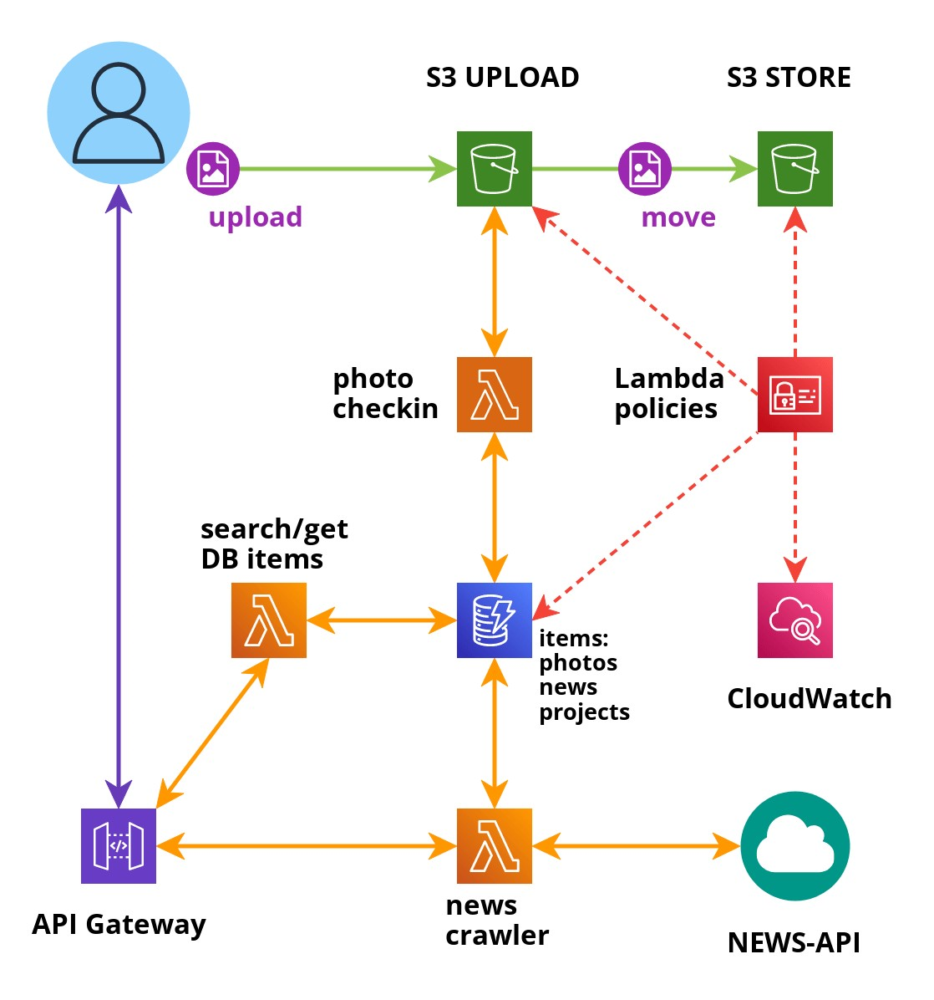

# kutter - Content Management System for photos and news articles
  - [Introduction](#introduction)
  - [Workflows](#workflows)
  - [Folder structure IaC](#folder-structure-iac)
    - [Terraform files](#terraform-files)
    - [Scripts](#scripts)
    - [Github deploy workflows](#github-deploy-workflows)
  - [Lambda functions](#lambda-functions)
    - [get_object](#get_object)
    - [list_objects](#list_objects)
    - [news_crawler](#news_crawler)
    - [photo_checkin](#photo_checkin)
    - [put_project_object](#put_project_object)
    - [requests_layer](#requests_layer)
  - [API Gateway](#api-gateway)
  - [DynamoDB](#dynamodb)
  - [IAM](#iam)
  - [logbook folder](#logbook-folder)
  - [Future prospect](#future-prospect)

## Introduction
"kutter" is a completly serverless content management system for photos and news-articles, builded in AWS, with an API Gateway based REST Interface. Above "kutter" a web frontend could be developed to create a journalist tool for article creation.
* Photo files are stored in a S3 bucket and metadata in a Dynamodb table
* News-articles are imported from the online NEWS-API
* All operations are computed by lambda functions and are secured by IAM policies
* For the deployment I used Terraform and I set up a CI/CD pipeline with GitHub actions.



## Workflows

Following workflows are implemented by the moment:
* Checkin of uploaded photo files to kutter-table.
* Import of news articles from news-api to kutter-table.

## Folder structure IaC
AWS services are deployed by Terraform HCL.

### Terraform files
Path: `./kutter/infrastructure/`

The folder contains tf-Terraform files -with the correspondent prefix- for the deployment of following AWS services.
* API-Gateway
* DynamoDB
* IAM
* Lambda
* S3

Besides, there is a "main.tf" and a "variables.tf" file, last for defining necessary variables. In "main.tf" a S3 Bucket is defined for terraform state files.

### Scripts
Path: `./kutter/infrastructure/scripts`

Following scripts are contained in the folder as bash (.sh) and powershell (.ps1) version:
* setup_terraform_bucket: to setup the S3 Bucket for Terraform state files.
* make_zip_lambda_functions: The source code for the Lambda functions and layers are compressed in Zip-files.

Both Scripts have to be executed before applying terraform.

### Github deploy workflows
Path: `./kutter/.github/workflows/deploy.yml`

Contains the "deploy.yml" file for the Github CI/CD pipeline.

## Lambda functions

The lambda functions are written in python 3.9.

### get_object
Path: `./kutter/get_object`

Function that allows to retrieve data from DynamoDB kutter-table items, like a photo- or a news-object. It's used by calling the REST-API endpoint `/prod/get-object?objectId=uuid`.

### list_objects
Path: `./kutter/list_objects`

Function that allows to list all DynamoDB kutter-table items, like a photo- or a news-object. It's used by calling the REST-API endpoint `/prod/`.

### news_crawler
Path: `./kutter/news_crawler`

Function that allows to retrieve news-articles from the online news archive [news-api]( https://newsapi.org/docs) and import them to DynamoDB kutter-table. It's used by calling the REST-API endpoint `/prod/news_crawler?topic=*&dateFrom=*`. It's necessary to provide a topic and a start date. It is planned to optimise search parameters regarding date and others.

### photo_checkin
Path: `./kutter/photo_checkin`

Function used to create an item in DynamoDB kutter-table for every uploaded file to S3 upload Bucket. The file is moved to S3 store Bucket after the upload and renamed with an uuid to avoid duplicates. For that a lambda-trigger is used on the S3 upload Bucket.

### put_project_object
Path: `./kutter/put_project_object`

Function to create project object items in DynamoDB kutter-table. REST-API endpoint: `/prod/put-project-object?location=*`

### search_objects
Path: `./kutter/search_objects`

REST-API endpoint: `/search-objects?search=*`

### requests_layer
Path: `./kutter/requests_layer`

Lambda layer for requests module, used by lambda function "news_crawler".

## API Gateway
API Gateway is deployed to provide REST API Endpoints. The endpoints are:
* `/prod/get-object?objectId=uuid`: to retrieve item information of the kutter-table object. "uuid" must be replaced by the item uuid.
* `/prod/`: list all items of the kutter-table.
* `/prod/news_crawler?topic=*&dateFrom=*`: list all news articles regarding topic-search and date. News are imported from news-api archive to the kutter-table.
* `/prod/put-project-object?location=*`: creates a kutter-table item of the type project-object. Project items main metadata information, by the moment, is the location where the news happend.
* `/search-objects?search=*`: executes a photo-object item search over the metadata "originalFileName" and "creationDate".

The root-address of the endpoints is not fix, because of the PoC character of this project, and could be retrieved from the AWS Service.

## DynamoDB
Object types in kutter-table:
* photo-object: metadata about the uploaded photo file.
* news-object: metadata about the imported news-article from news-api archive.
* project-object: metadata about project items. Project items will be further developed to make and save collections of photos, news and text assets.

### photo-object metadata
Key-value pairs:
```
{"objectId": uuid,
"objectType": "photo-object",
"originalFileName": string,
"s3Bucket": string,
"creationDate": date}
```

### news-object metadata
Key-value pairs:
```
{"objectId": uuid,
"objectType": "news-object",
"title": string,
"creationDate": date,
"url": string}
```

### project-object metadata
Key-value pairs:
```
{"objectId": uuid,
"objectType": "project-object",
"newsLocation": string,
"creationDate": date}
```

## IAM
Lambda functions' access to all ressources, like DynamoDB, S3 Buckets and CloudWatch, are rescricted by a policy document following PoLP.

## logbook folder
Path: `./kutter/logbook`
contains file "bookd.md". Here are the online ressources documented I used to build the AWS infrastructure.

## Future prospect
The backlog is full. Here are some possible improvements:
- Improving kutter-table item search.
- Adding deletion handling for kutter-table items.
- Import of metadata from photo files, like geographic information
- Trigger of news archive search automatically by photo metadata like date and geo-data.
- Adding more free online APIs to get more ressources for enriching news articles, e.g. Wikipedia, Google Maps...
- Adding SNS for notification of news ressources updates.
- New features to make kutter-table project-objects a powerful tool to organise news assets.